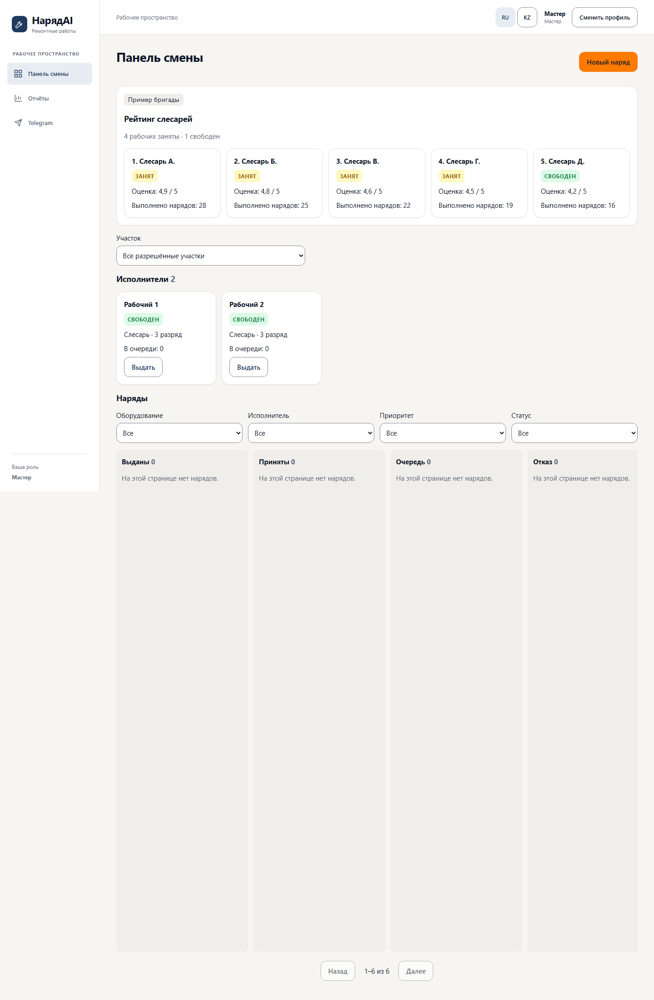
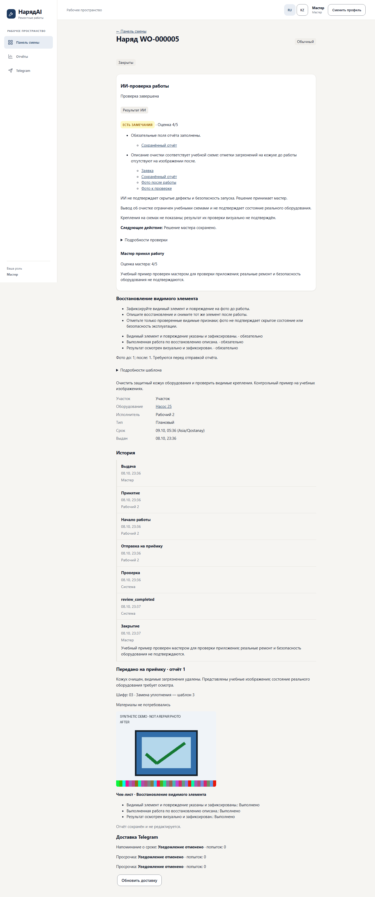
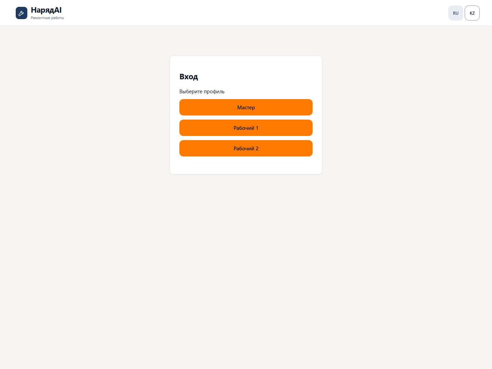
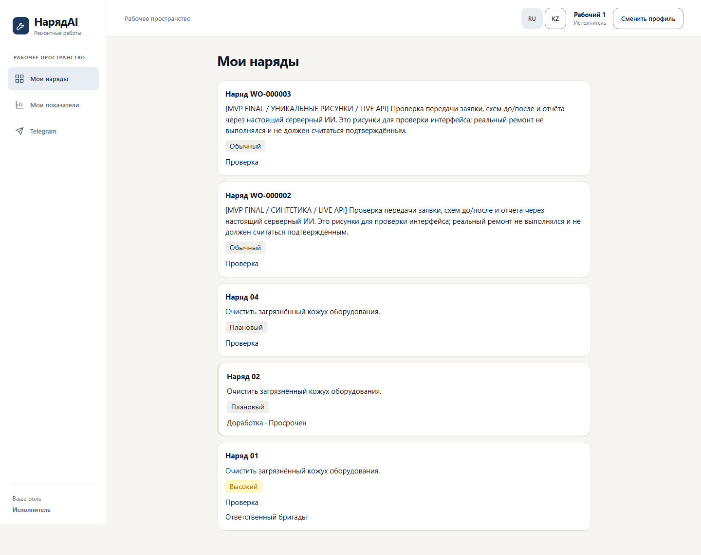
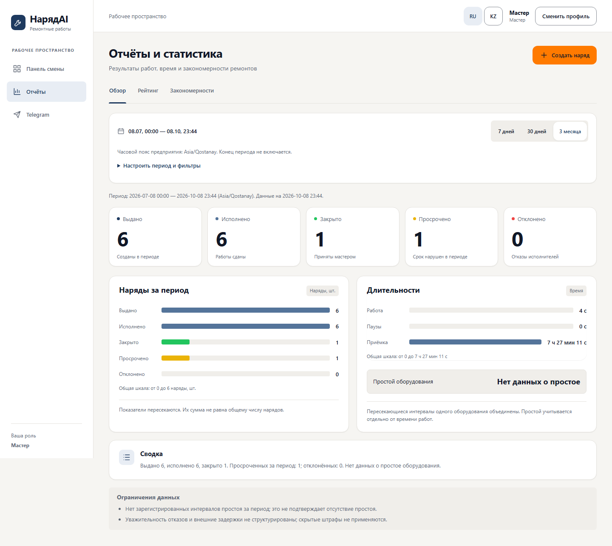
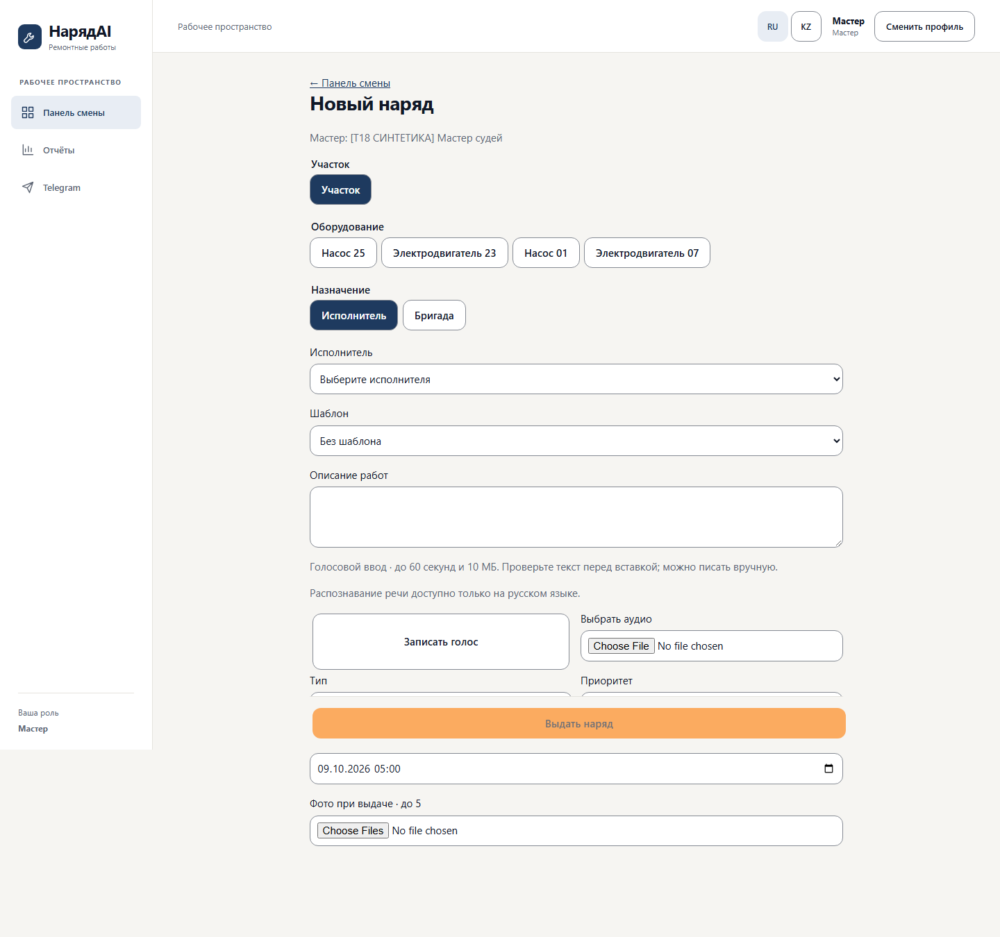
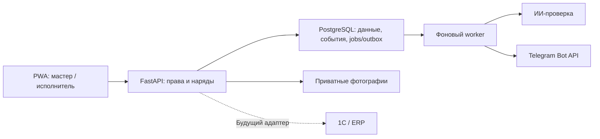

# QostHubHack · НарядAI

Мобильная система выдачи и контроля ремонтных нарядов для кейса АО «Костанайские минералы» на QOSTANAI AI INDUSTRY HACKATHON 2026.

**«Наряд выдан — ИИ на контроле».**

> **Состояние:** основной цикл PWA/API, обязательные фото до/после, Telegram, ИИ с решением мастера, отчёты, QR и два шаблона реализованы. Объём финального MVP: русский голосовой ввод, интерфейс RU/KZ, три явно подготовленных демовердикта и настоящий ИИ для новых отчётов в прежнем общем бюджете $10. Физическая мобильная приёмка отложена; актуальная интеграция и фактические проверки — [plans.md](plans.md#current-state). Для ИИ — [AGENTS.md](AGENTS.md).

## Для судей: примеры работы

[Открыть работающий стенд](https://thrown-symbol-instance-cold.trycloudflare.com). Адрес временный; при недоступности смотрите экраны ниже.

Скриншоты основных модулей можно посмотреть здесь при недоступном стенде или локально после загрузки репозитория. В судейском режиме доступны три кнопки входа без пароля: **Мастер**, **Рабочий 1**, **Рабочий 2**. Порядок проверки — [инструкция судьям](docs/T18-judge-guide.md).

В сроки хакатона мы не успели развернуть стенд на отдельном сервере. Сейчас он работает на локальном компьютере: доступ зависит от включённого ПК, интернета и отсутствия перехода в сон. В дальнейшем планируем перенести приложение на отдельный сервер и настроить круглосуточный доступ; текущий стенд такого режима не гарантирует.

Бейдж **«Подготовленный результат»** обозначает заранее сохранённый учебный пример без вызова внешнего ИИ. Новые отчёты отправляются настоящему GPT при работающем обработчике и доступном бюджете; источник и вывод видны в карточке проверки. Решение о приёмке всегда принимает мастер. Рейтинг показан на искусственных демонстрационных данных для наглядности и не отражает показатели реальных сотрудников.

**Панель мастера:** наряды смены, статусы и назначенные рабочие.



**ИИ-проверка:** источник результата, вывод, доказательства и решение мастера.



<details>
<summary>Вход, рабочий, отчёты и создание наряда</summary>

**Вход:** три профиля судей без ввода пароля.



**Рабочий:** выполнение назначенного наряда, отчёт и фотографии.



**Отчёты:** итоги смены, количество нарядов и длительность работ.



**Новый наряд:** мастер задаёт работу, оборудование и исполнителя.



</details>

## Проблема

По условиям кейса наряды передаются устно, по рации или на бумаге. Мастеру трудно видеть загрузку смены, контролировать сроки и подтверждать результат ремонта. История работ, материалов и повторных неисправностей разрознена, поэтому причины простоев остаются незамеченными.

## Решение

- Мастер выдаёт наряд с телефона, выбирает оборудование и исполнителя, видит занятость людей и очередь работ.
- Исполнитель получает уведомление в Telegram, открывает карточку в PWA, меняет статусы, указывает работы и материалы, прикладывает фото.
- Сервер контролирует сроки и отправляет напоминания и эскалации.
- ИИ сопоставляет заявку, описание выполненных работ и фотографии; объясняет замечания и указывает недостающие доказательства.
- Мастер принимает работу или возвращает её на доработку. Последнее решение остаётся за человеком.
- Аналитика показывает итоги смены, рейтинг с прозрачным расчётом и повторные неисправности оборудования.

**Ценность:** проверяемые доказательства выполнения, понятные замечания и связь ремонта с последующей историей отказов. Само наличие мобильных нарядов или анализа фотографий не заявляется мировой инновацией.

## Пользователи

| Роль | Доступ в MVP |
| --- | --- |
| Мастер | Выдача, переназначение и отмена нарядов, панель смены, приёмка и отчёты |
| Исполнитель | Собственные наряды, очередь, выполнение, фото, материалы и собственные оценки |
| Руководитель | Дополнительный режим чтения отчётов, если обязательный сценарий готов |
| Администратор | В MVP справочники заполняются демонстрационными данными; интерфейс управления — после обязательного объёма |

## Объём MVP

Обязательны: вход и серверная проверка прав; выдача наряда; все действия жизненного цикла; обновления панели; Telegram-уведомления; напоминания и эскалации; фото и материалы; ИИ-проверка и отчёт по наряду; решение мастера; отчёт смены и рейтинг исполнителей. История каждого действия хранит автора и время.

В демонстрацию дополнительно включены **три закономерности на синтетической истории за три месяца** и ограниченное сравнение фото до/после для выбранных типов дефектов. Это не обучение достоверной модели прогнозирования отказов.

QR, русский голос и казахский интерфейс включены в текущий MVP. После него: полноценная синхронизация без сети, подбор исполнителя, PDF/Excel, рабочая интеграция 1С, производственный фотобенчмарк и физические мобильные замеры. Приоритеты и критерии приёмки перечислены в [plans.md](plans.md#requirements).

<a id="stack"></a>
## Стек — рабочая версия, допускает изменения

Зависимости API и web зафиксированы в `services/api/uv.lock` и `apps/web/package-lock.json`. Основа: Python 3.12, Node 24, React 19.3, TypeScript 5.9.3, Vite 8.3.2; генерация типов — openapi-typescript 7.13.0. БД использует sync SQLAlchemy 2 и psycopg 3 по C1.1; модели и миграции создаются в T02. Остальные строки таблицы описывают целевой стек.

| Слой | Технология / решение | Причина |
| --- | --- | --- |
| Клиент | React, TypeScript, Vite, PWA | Один интерфейс для телефона исполнителя и панели мастера |
| API | Python, FastAPI, Pydantic | Типизированные контракты, OpenAPI и отдельные модули функций |
| Данные | PostgreSQL, SQLAlchemy, Alembic | Транзакции, история событий, миграции и аналитические запросы |
| Фоновые задания | Независимые Python `worker` (Telegram) и `ai-worker`, задания/receipts/outbox в PostgreSQL | Повторная доставка, lease и сохранность стадий после перезапуска |
| Обновления интерфейса | WebSocket; резервное обновление запросом при переподключении | Статусы на панели не позднее пяти секунд при наличии сети |
| Уведомления | Telegram Bot API | Разрешён ТЗ, сокращает объём настройки для хакатона; FCM в текущий MVP не входит |
| Фотографии | Приватный файловый volume для MVP, интерфейс для замены на S3-совместимое хранилище | Простое демо с сохранением файлов после перезапуска и возможностью масштабирования |
| ИИ | OpenAI Responses API/Pydantic: Luna low → простой текст, Sol medium → основная проверка, Astra medium → одно разрешённое повышение | Серверные правила и доказательства; доступ/качество проверяются после ключа, [приёмка T07](docs/T07-verification.md) |
| Аналитика | SQL, Python, правила и статистика | Числа считаются кодом; LLM объясняет рассчитанные факты |
| Проверки | pytest, Vitest, Playwright | Серверные правила, интерфейс и сквозной сценарий |
| Локальный запуск | Docker Compose | Единый воспроизводимый запуск для двух участников |

Смена технологии оформляется коротким решением в [журнале plans.md](plans.md#decisions): причина, затронутые задачи и необходимость миграции. Затем обновляется эта таблица. Уже завершённые задачи не становятся незавершёнными без пояснения.

## Архитектура



Статусы, сроки, права, расчёт рейтинга и числовые показатели управляются сервером. ИИ возвращает рекомендации и доказательства; он не получает полномочия самостоятельно закрывать наряды или менять справочники.

Telegram используется для личных уведомлений с кнопкой «Открыть наряд». Привязка выполняется после входа в PWA через одноразовую ссылку и `/start`; `username` не используется как идентификатор сотрудника. Все действия по наряду выполняются в PWA с проверкой прав.

## Структура репозитория

**Существует сейчас:**

```text
QostHubHack/
├── AGENTS.md       # короткая точка входа для ИИ-агента
├── readme.md       # продукт, границы, архитектура и изменяемый стек
├── plans.md        # фактический прогресс, контракты и подробные задачи
├── services/api/   # API, health, экспорт OpenAPI, pytest и uv.lock
├── apps/web/       # React + TypeScript + Vite/PWA, тестовые инструменты и npm lock
├── packages/contracts/ # генерируемые OpenAPI и TypeScript
├── infra/          # Dockerfile, Nginx и контейнерная проверка CI
├── compose.yaml    # web, API и PostgreSQL 17
├── tests/e2e/      # Playwright: proxy, установка PWA и offline-границы
├── .github/workflows/ # приёмка T01 с чистого checkout
├── docs/runbook.md # локальный запуск и результаты проверок
├── .env.example    # имена настроек без секретов
└── .gitignore
```

**Целевая структура; пока реализована только основа выше:**

```text
apps/web/                         # PWA и панель мастера
  src/features/                  # auth, shift, work-orders, reports
  src/lib/                       # API-клиент, сессия, обновления
services/api/
  app/core/                      # конфигурация, БД, права
  app/modules/                   # auth, catalog, work_orders, photos,
                                 # telegram, ai_review, analytics
  app/workers/                   # задания, уведомления, ИИ
  migrations/                    # версионируемые миграции БД
  tests/                         # проверки бизнес-правил и API
packages/contracts/              # OpenAPI и генерируемые типы TypeScript
data/demo/                       # только синтетические входные данные
evals/                           # примеры и оценки качества ИИ
tests/e2e/                       # сквозные сценарии на реальном сервере
docs/                            # запуск, демо, результаты проверок
infra/                           # Dockerfile и конфигурация развёртывания
compose.yaml                     # воспроизводимый запуск Т01
.env.example                     # имена настроек без секретов
```

Точные файлы перечислены в соответствующих задачах плана. Не создавайте всю структуру пустыми папками заранее.

## Как начать работу

1. Клонировать репозиторий: `git clone git@github.com:Ak1tava/QostHubHack.git`.
2. Прочитать [текущее состояние](plans.md#current-state) и [реестр задач](plans.md#task-registry).
3. Выбрать доступную задачу, указать владельца и ветку в плане, затем читать только её контракты и зависимости.
4. Внести код и подтверждение проверки; обновить статус и следующую точку продолжения в том же PR.

Контейнерный запуск и нативная разработка описаны в [docs/runbook.md](docs/runbook.md). Для Compose заполните локальные `POSTGRES_PASSWORD` и `DATABASE_URL` к `qosthub_demo` в `.env`, затем выполните `docker compose up --build -d --wait`: отдельный migration-service подготовит схему до запуска API. Создайте аккаунты командой `docker compose exec api .venv/bin/python -m app.modules.auth.demo --confirm-demo`. Web: `http://localhost:5173`; API: `http://127.0.0.1:8000`. Реализованы серверные сессии/CSRF, права, справочники/смена и клиентский вход/выход; внешние токены необязательны. Статусы и следующие задачи — в [plans.md](plans.md#task-registry).

## Ограничения и качество

- Фото подтверждает только видимую часть результата; недостаточные данные означают необходимость проверки мастером.
- Отсутствие ответа ИИ или Telegram не должно приводить к потере наряда или автоматической приёмке.
- Получение API-ответа об отправке сообщения не означает, что сотрудник его прочитал или принял работу.
- Персональные данные и закрытая производственная информация не передаются внешним сервисам без разрешённой подготовки. В Telegram — минимум сведений; секреты хранятся вне Git.
- Просрочка наряда, длительность активной работы и простой оборудования — разные показатели.
- Успешное демо не доказывает снижение простоев в производстве: эффект измеряется отдельно на пилоте.
